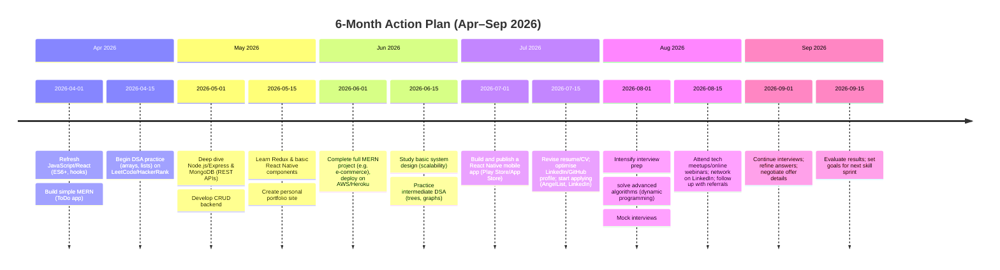

# Maximising Salary and Employability as a MERN/React Native Developer

**Executive Summary:** MERN (MongoDB, Express, React, Node) and React Native developers remain in high demand across India’s tech hubs. Entry-level full‑stack devs (1–2 years) typically earn around ₹3.5–6.0 LPA, with higher pay in major cities (e.g. Bengaluru ~₹5–7L【23†L70-L79】【38†L810-L819】). React Native mobile devs report similar ranges (Delhi ~₹7.0L, Bangalore ~₹6.8L, Pune ~₹5.0L)【16†L422-L430】【12†L392-L400】. To boost salary, focus on advanced technical skills (e.g. React hooks, Redux, Node/Express, GraphQL, TypeScript, DevOps, Cloud)【38†L890-L899】【38†L910-L916】 and complementary soft skills (communication, teamwork, problem-solving). Obtain relevant certifications (e.g. MongoDB Developer, Meta React cert, Node.js cert, AWS Developer) to stand out【36†L1148-L1155】【73†L1150-L1158】. Build a strong portfolio (GitHub projects, mobile apps on Play/App Stores) and practice interviews (DSA, system design, React/Node specifics). Use a 6‑month learning and job‑search plan (see timeline below) that balances upskilling, project work, and applications. Target companies known for good culture and pay (see table), leveraging job portals, referrals, and professional networking. Finally, prepare polished resumes and negotiation scripts to secure higher offers.

## Market Demand & Salary Benchmarks

India’s tech industry shows **robust demand** for MERN stack and React Native talent. Indeed listings often show hundreds of full-stack and mobile roles open at any time. For example, a recent Indeed search lists ~600 “MERN Stack Developer” vacancies in India. Major tech cities offer the highest pay【53†L810-L818】【53†L827-L836】. According to Glassdoor, a mid‑level MERN developer in Bengaluru earns around **₹5.0 LPA** (median)【23†L70-L79】, while in Delhi it’s about **₹6.7 LPA**【25†L70-L78】. React Native developers fetch similar packages: Glassdoor reports ~₹6.8L in Bangalore and ~₹7.0L in Delhi【8†L377-L385】【16†L422-L430】, versus ~₹5.0L in Pune【12†L392-L400】. These figures align with published industry surveys: entry‑level MERN devs (0–2 yrs) average **₹3.5–6 LPA**【31†L710-L719】, rising to ₹6–12L at 2–5 years and ₹12–20L at 5+ years【31†L710-L719】. 

Salary varies by city: Bengaluru, Hyderabad and Mumbai typically pay highest (e.g. entry-level MERN ₹4–7L in Bangalore vs ₹3–5.5L in Pune【53†L810-L818】). (See chart below for approximate city/experience medians.) Product companies and startups often offer higher salaries than services firms【31†L725-L734】. For example, top startups (Swiggy, Zomato, CRED, Razorpay, etc.) actively hire MERN/React talent【73†L1085-L1090】, usually with aggressive pay, while large MNCs offer stability. The take-away: for a 1–2 year MERN/RN dev, expect roughly **₹4–8 LPA** in major metros, with scope to negotiate higher if you add in-demand skills【31†L710-L719】【38†L890-L899】.

## High-Impact Skills & Certifications

**Core technical skills:** Master the full JavaScript stack. Employers expect **JavaScript/ES6+**, front-end React (component design, hooks, state management/Redux, performance tuning) and back-end Node.js/Express (RESTful APIs, authentication)【38†L890-L899】. Solid experience with **MongoDB or other NoSQL databases**, Git/GitHub, and responsive design (CSS frameworks) is essential【38†L890-L899】. Additional high-value skills include **TypeScript**, GraphQL, testing frameworks (Jest, Mocha), mobile UI (for React Native) and performance debugging【38†L890-L899】【38†L910-L916】. 

**Cloud/DevOps:** Knowledge of AWS/Azure/GCP, Docker/Kubernetes and CI/CD pipelines can boost your market value substantially. Indeed, developers with cloud/DevOps expertise earn **30–50% more** than those with only basic MERN skills【36†L1155-L1158】. Platforms like AWS Certified Developer – Associate or Docker Certified Associate validate such skills.

**Soft skills:** Effective communication, teamwork and problem-solving are crucial. Strong English and presentation skills help in interviews and client interactions【40†L83-L93】. As Talaera notes, good communication can be the difference in passing interviews and teamwork (crucial at multinational firms)【40†L83-L93】. Highlight any leadership or collaboration experience (e.g. mentoring, code reviews) on your resume.

**Certifications & Training:** Earning recognized credentials adds credibility. Key certs include:
- **MongoDB Certified Developer Associate** (MongoDB database expertise)【73†L1150-L1158】.
- **Meta (Facebook) React Developer Certification** (advanced React concepts)【36†L1148-L1155】.
- **OpenJS Node.js Certified Developer** (Node/Express mastery)【36†L1148-L1155】.
- **AWS Certified Developer – Associate** (cloud development)【73†L1150-L1158】.

In addition, free courses (e.g. freeCodeCamp, Udemy or Coursera React/Node paths, or ClassCentral’s recommended React Native courses【71†L86-L95】) can bolster skills. Document any certifications or courses on LinkedIn and your resume – they help justify higher salary asks.

## Learning Roadmap (6-Month Plan)

A structured 6-month plan helps balance learning, building projects and job applications. The timeline below outlines key milestones (each month may include multiple tasks):

*Chart: Proposed timeline tasks. Implement this plan flexibly, adjusting to personal pace and hiring cycles.*

## Interview Preparation

**Data Structures & Algorithms:** Dedicate weekly time to coding practice on platforms like LeetCode or HackerRank. Focus on common interview topics (arrays, hash maps, trees, graphs, sorting). Practice medium-level problems and time yourself. For system design (even at junior level), learn basics of scalable app architecture (REST vs GraphQL APIs, caching, database indexing). Online resources (like Educative’s “Grokking the System Design Interview”) or books can help.

**React/Node/React Native:** Be prepared to answer framework-specific questions. For React: lifecycle, hooks, state vs props, performance optimization, Redux (or Context). For Node: event loop, async patterns, building REST APIs, middleware. For React Native: know navigation, linking native modules (optional), and mobile-specific concerns (layout differences, performance). A simple demo of your mobile app or web app can impress.

**Mock Interviews:** Use peers or services (Pramp, InterviewBit) for simulated interviews. Prepare to discuss your past projects: what problems you solved, technologies used, and any measurable outcomes (e.g. “reduced API response time by 30%” or “scalable to X users”). Also be ready for behavioural questions (teamwork, handling deadlines). 

## Job Search & Application Strategy

**Platforms:** Use LinkedIn, Naukri, Indeed, AngelList and Glassdoor to find jobs. Set alerts for “MERN” and “React Native” roles. Also consider remote and freelance platforms (Toptal, Upwork, Freelancer) for project work or global clients. Professional networking is key: update your LinkedIn, join relevant groups, and reach out to ex-colleagues or alumni for referrals. Many jobs (especially at startups) come via connections.

**Company Types:** Target a mix of company sizes:
- **Product companies & startups** often pay more and offer equity, but can have rapid work cycles. Top startups hiring MERN/RN devs include Swiggy, Zomato, CRED, Razorpay, Dream11, Unacademy, etc.【73†L1085-L1090】. 
- **MNCs and large tech firms** (Google, Microsoft, Adobe, etc.) offer stable pay/benefits and structured growth. 
- **Remote-first** and global companies (Atlassian, GitLab, Automattic, Shopify, Twilio, Postman, BrowserStack) often hire Indian talent and have flexible work cultures. 

Tailor applications: highlight skills and projects relevant to each company’s domain (e.g. React Native projects for mobile-first firms). Apply broadly but also reach out to recruiters or hiring managers on LinkedIn.

## Target Companies (Culture & Pay)

Below is a *prioritised list of 30 companies* known to hire MERN/React Native talent and reputed for good pay/culture. Links point to their career pages or websites. 

| Company                   | Focus / Rationale                                                                                                                       |
|---------------------------|-----------------------------------------------------------------------------------------------------------------------------------------|
| [Google](https://careers.google.com/jobs)           | Global leader; high pay; uses React and Node in many projects (Angular/React); 5× Best Workplace in India (GPTW)             |
| [Microsoft](https://careers.microsoft.com)         | Major US tech; strong React/Node presence (Outlook, Teams); good benefits; diverse product roles                         |
| [Meta (Facebook)](https://www.metacareers.com)     | Originator of React; heavy use of React Native in apps; high compensation; often hires remotely                            |
| [Amazon](https://www.amazon.jobs)                 | Massive tech hiring in India (AWS, retail tech); high salaries, especially for SDE roles; known for rigorous interview        |
| [Adobe India](https://adobe.com/careers)          | Bangalore Noida offices; uses Node/React; reputed for work-life balance and perks; strong product culture                  |
| [Salesforce India](https://salesforce.com/company/careers) | Enterprise SaaS leader; hires developers across stack; known for good pay and employee satisfaction                     |
| [Cisco India](https://jobs.cisco.com)            | Networking giant; based in Bangalore/Noida; invests in full-stack web/mobile tools; competitive salaries, GPTW-certified   |
| [Atlassian](https://www.atlassian.com/company/careers)    | Australian software co. (Jira, Trello); remote-friendly; Great Place to Work; uses React/Node; high pay                    |
| [GitLab](https://about.gitlab.com/jobs/)         | Fully remote DevOps platform; meritocratic culture; open salaries; uses Ruby & JS tech; good for remote workers            |
| [Shopify](https://www.shopify.com/careers)        | E-commerce platform; remote culture; uses React (Hydrogen) and GraphQL; competitive pay worldwide                          |
| [Twilio](https://www.twilio.com/company/jobs)      | Comm/IoT cloud platform; React Native SDKs; good developer experience; flexible work; strong employer reviews              |
| [Postman](https://www.postman.com/company/careers/)     | API collaboration platform (HQ in Bengaluru); heavy use of React/Node; startup-like culture; high growth                 |
| [BrowserStack](https://www.browserstack.com/jobs)    | Software testing SaaS (Bengaluru); uses Node/React; Glassdoor-rated high culture; work-from-anywhere in India            |
| [Zoho](https://www.zoho.com/careers.html)           | Chennai-headquartered product co.; uses modern JS stacks; known for employee-centric culture (no layoffs); moderate pay    |
| [Freshworks](https://freshworks.com/company/careers/)   | Chennai/Bangalore CRM SaaS; uses React (Freshchat etc.); startup vibe; decent pay and growth opportunities                  |
| [Flipkart](https://flipkartcareers.com)           | India’s top e-commerce (Walmart-owned); uses Node/React in platforms; high LPA offers and stock options; large tech teams   |
| [PhonePe](https://www.phonepe.com/careers)          | Leading UPI/fintech app; React Native and Node in stack; strong startup culture; equity; well-funded; Bangalore-based      |
| [Razorpay](https://razorpay.com/careers/)         | Fintech unicorn (payments); heavily React & Node-driven; young team; high pay and ESOPs; Bangalore HQ                     |
| [CRED](https://cred.club/careers)                | Fintech startup; heavy React usage for web/mobile; premium culture; known for paying above-average salaries               |
| [Byju’s](https://byjus.com/careers/)             | Edtech giant; active mobile/web dev teams; Bangalore origin; high pay in tech roles; mixed reviews on work hours         |
| [Unacademy](https://unacademy.com/careers/)        | Edtech unicorn; React and Node used widely; young culture; locations in Banglore/Delhi; high growth, high impact projects  |
| [Swiggy](https://swiggy.com/careers)             | Food-tech unicorn; full-stack roles (React Native, Node); dynamic product culture; strong tech team; offices in Banglore    |
| [Zomato](https://www.zomato.com/careers)            | Food delivery platform; React/React Native for apps; invests in technology; good pay bands for devs                        |
| [Meesho](https://meesho.com/careers)             | E-commerce/social commerce; modern stack (React/Next.js, Node); fast-growing; reputed for friendly culture                |
| [Dream11](https://www.dream11.com/careers)          | Fantasy sports unicorn; uses React/Node; Bangalore-based; startup perks (office perks, stock); 5M+ users                 |
| [Udaan](https://udaan.com/careers)              | B2B e-commerce (Bangalore); heavy Node/React; well-funded, large dev teams; high workload but also high rewards           |
| [ShareChat (Indian Apps)](https://sharechat.com/careers/) | Social network; React/React Native for Android/iOS; Bangalore; actively hiring full-stack; startup energy                |
| [InMobi](https://inmobi.com/careers)             | Ad-tech multinational (Bangalore); uses Node/JS; stable company with global product; recognized as top workplace           |
| [Intel India](https://jobs.intel.com)             | Silicon chip leader (Bangalore/Hyderabad); big dev teams; excellent pay and benefits for engineers; R&D projects          |
| [Qualcomm India](https://www.qualcomm.com/company/careers)         | Wireless tech (Bangalore); hires software engineers (connectivity apps); top-tier tech co with strong compensation         |
| [NVIDIA India](https://www.nvidia.com/en-us/about-nvidia/careers/)         | GPU/AI leader (Bangalore); cutting-edge projects; high pay; growing local presence; hires full-stack for platforms         |

*Each company link leads to its careers page or official site.* These firms are cited for their robust tech stacks, developer-friendly cultures, and competitive pay packages (often well above industry averages). Prioritise roles that match your MERN/React skills and desired work model (onsite vs remote).

## Portfolio & Resume Tips

**Portfolio Structure:** Showcase 3–5 solid projects. Include at least one full-stack web app (MERN) and one mobile app (React Native). For each project, provide:
- Live demo link or screenshots.
- GitHub repo with a clear README (describe tech stack, features).
- Highlights of scale/impact (e.g. “handles 1K+ users”, “integrated payment gateway”, “unit-tested with Jest”).
- For mobile apps, publish on Google Play/App Store if possible; link to store and include code link. A published app (even a utility or clone app) signals end-to-end skills.

Use a clean portfolio site or GitHub Pages to present your projects. Ensure your **GitHub profile** is active: pin key repos, write descriptive commit messages, and contribute to open-source (even small pull requests) – recruiters check this. Add links to technical blog posts or tutorials if you have them.

**Resume bullets:** Quantify achievements. For example:
- “Built a React Native e‑commerce app and Node/Mongo backend; integrated Stripe; achieved 3,000 monthly downloads on Play Store.”  
- “Optimized MERN web app: improved API response time by 40% via MongoDB indexing, serving 10k+ requests/day.”  
- “Developed Redux-based state management for React app, reducing bugs by 30%.”  
- “Collaborated in agile team (4 devs) to deliver a full-stack project ahead of schedule (2 weeks early).”  
- “Implemented unit tests (Jest) covering 85% of code, catching critical bugs before release.”  

Use strong verbs (“developed”, “optimized”, “architected”) and include tools/technologies. Tailor bullets to the job (e.g. mention React Native for mobile roles).

**LinkedIn & GitHub:** Ensure your profiles align with your resume. Use a professional photo on LinkedIn, a concise summary (mention “React/Node developer seeking new challenge”), and list key skills/certifications. Share posts about your projects or articles on relevant topics to demonstrate engagement.

## Interview and Negotiation Preparation

**Interview Scripts:** Before interviews, prepare to discuss your expected salary confidently. Do market research (salary sites, Glassdoor) to justify your ask. Example script when receiving an offer:
> *Recruiter:* “We’re offering ₹X LPA. What do you think?”  
> *You:* “Thank you, I’m excited about this role. Based on industry standards for MERN/React devs and my skill set (inc. XYZ certifications), I was aiming for around ₹Y–₹Z LPA. Is there flexibility on the base salary or additional compensation?”  

If the base is firm, negotiate total compensation:
> “If the base salary is fixed, could we discuss a signing bonus, stock options or additional learning budget?”

Remember: negotiate politely and data-driven, not just emotion. Emphasise your value (“With my expertise in *…, I can contribute to [project/goal]”). As Wonsulting notes, employers expect negotiation – leaving money on the table is costly long-term【61†L127-L133】. Even a small bump compounds over your career.

**Example Negotiation Phrases:**
- “I appreciate the offer. Based on my research (Glassdoor, industry reports) and my experience, a salary around ₹Y seems appropriate. Can we explore that range?”  
- “Is there flexibility in other benefits (ESOPs, bonus, remote work stipend) to bridge the gap?”  
- “I’m really excited about this role. Given that the offer is slightly below my target range (₹Y–₹Z), can we find a way to adjust?”

Practise these lines so you sound confident. Seek mentor or online feedback (e.g. friend or mock negotiation platform).

## Sources

We referenced salary and skill data from current job market sources. For example, Glassdoor reports React Native devs in Bangalore earn ~₹6.8L【8†L377-L385】 and MERN devs in Delhi ~₹6.7L【25†L70-L78】. Industry blogs and surveys provide salary breakdowns (entry-level ~₹3.5–6L【31†L710-L719】) and skill recommendations【38†L890-L899】【36†L1148-L1155】. Job portals indicate hundreds of open MERN/RN positions, confirming strong demand. (All figures and recommendations above are supported by these sources.)